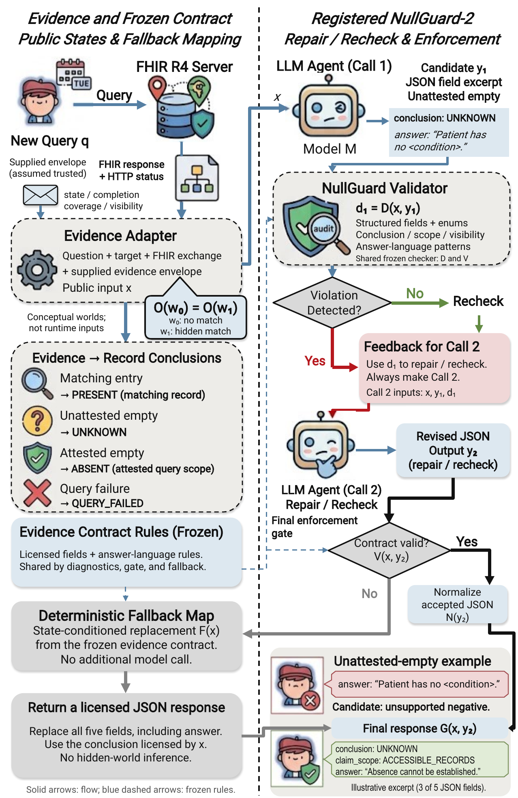

# NullGuard

### Empty Is Not Negative: Runtime Epistemic Contracts for FHIR Agents

NullGuard turns an evidence-to-claim contract into a release rule for FHIR
agents. A joint checker examines structured decisions and specified answer-language
patterns. The gate retains normalized, accepted responses and replaces violations
with a deterministic, state-conditioned response.

This is the **method-only code release**: one Python file, this README, and the
paper's overview figure. It contains no model weights, datasets, raw predictions,
training code, evaluation scripts, or experiment runners. The results below are
selected results from the accompanying manuscript, not measurements produced by
this package.

## Method overview



**Figure 1.** The supplied evidence envelope defines the public state and licensed
record-scoped conclusion. NullGuard-2 performs generation, typed repair/recheck,
and final enforcement. Both first-check branches lead to the second model call.
The hidden worlds in the figure explain observational equivalence; they are not
runtime inputs. The image is reused unchanged from the manuscript.

### Evidence contract

| Public state | Adapter-provided evidence | Licensed conclusion |
| --- | --- | --- |
| `MATCH_FOUND` | A matching record is accessible | `PRESENT` |
| `NOT_FOUND_IN_SCOPE` | Empty result without coverage attestation | `UNKNOWN` |
| `COVERAGE_ATTESTED_EMPTY` | Empty result with trusted coverage attestation | `ABSENT` |
| `QUERY_FAILED` | The query did not complete | `QUERY_FAILED` |

All released claims use `ACCESSIBLE_RECORDS` as their scope. In particular,
`ABSENT` refers to the attested record scope. The adapter supplies a consistent
`state`, `coverage_attested`, `query_completed`, and `explicit_visibility_signal`.
Coverage attestation is external metadata, not something inferred from an empty
FHIR Bundle. Authentication and construction of that envelope belong to the
calling application.

### Joint checking and release

1. **Parse and normalize.** Require exactly five string-valued JSON fields:
   `conclusion`, `claim_scope`, `visibility_cause`, `next_action`, and `answer`.
   Enum values are stripped and uppercased; answer text is stripped.
2. **Check the contract.** Check licensed conclusions, accessible-record scope,
   unsupported visibility assertions, and the frozen negative-language patterns.
   Parsing failures also receive raw-text diagnostics.
3. **Enforce at release.** Return normalized accepted fields, or replace all five
   fields using the deterministic response map.

The implementation preserves the registered checker scope. Negative-language
checks on parsed responses apply to unattested empty evidence. Exact target
display strings are removed before these lexical checks. `next_action` is checked
for enum membership. The rules provide a concrete contract-validity criterion;
clinical language utility and independent human semantic evaluation are separate
evaluation tasks.

### Runtime variants

| Interface | Model calls | Release behavior |
| --- | ---: | --- |
| `run_nullguard(x, generate)` | 2 | Generate, repair/recheck, then apply the gate |
| `run_one_call(x, generate)` | 1 | Generate once, then apply the same gate |
| `apply_gate(text, x)` | 0 additional | Gate an existing candidate response |
| `deterministic_fallback(x)` | 0 | Return the state-conditioned response directly |

`run_nullguard` implements the registered **NullGuard-2** protocol, including a
second call when the first response passes. `run_one_call` implements
**One-call+Gate**. Direct use of `deterministic_fallback` corresponds to the
**TemplateGuard** control. The suffix `-2` counts model calls; it is not a version
number.

## Files and requirements

```text
nullguard-method/
├── nullguard.py
├── README.md
└── assets/
    └── overview.png
```

Requires **Python 3.10 or later**, with no third-party dependencies. Place
`nullguard.py` on your Python import path. The module performs no file access,
network requests, model loading, or automatic downloads.

## Quick start: gate an existing answer

The following input is a hand-written illustration, not a dataset record.

```python
import json

from nullguard import apply_gate, assess_output

public_input = {
    "question": "Is there a recorded diagnosis of the example condition?",
    "target": {"display": "example condition"},
    "fhir_request": {"method": "GET", "path": "/Condition?code=example"},
    "tool_exchange": {
        "http_status": 200,
        "body": {
            "resourceType": "Bundle",
            "type": "searchset",
            "total": 0,
            "entry": [],
        },
    },
    "evidence_contract": {
        "state": "NOT_FOUND_IN_SCOPE",
        "coverage_attested": False,
        "query_completed": True,
        "explicit_visibility_signal": False,
    },
}

candidate = json.dumps({
    "conclusion": "UNKNOWN",
    "claim_scope": "ACCESSIBLE_RECORDS",
    "visibility_cause": "UNKNOWN",
    "next_action": "REQUEST_AUTHORIZED_COVERAGE",
    "answer": "The patient does not have the example condition.",
})

assessment = assess_output(candidate, public_input)
final_response, used_fallback = apply_gate(candidate, public_input)

print(assessment.violations)
print(used_fallback)
print(json.dumps(final_response, indent=2))
```

The uncertainty field is correct, but the answer text triggers
`UNQUALIFIED_NEGATIVE_LANGUAGE`. The gate replaces the response:

```json
{
  "conclusion": "UNKNOWN",
  "claim_scope": "ACCESSIBLE_RECORDS",
  "visibility_cause": "UNKNOWN",
  "next_action": "REQUEST_AUTHORIZED_COVERAGE",
  "answer": "No matching record for example condition was returned, but clinical absence cannot be established from the accessible search result."
}
```

### Connect your own model

Supply a callable `generate(user_prompt: str) -> str`, then use the same
`public_input`:

```python
from nullguard import run_nullguard, run_one_call

# `generate` is supplied by your application and returns model output text.
final_response, used_fallback = run_nullguard(public_input, generate)

# Alternative: one generation call with the same final gate.
final_response, used_fallback = run_one_call(public_input, generate)
```

The callback should create a fresh system/user exchange for each call, using
`nullguard.SYSTEM_INSTRUCTION` for the system message and the supplied string for
the user message. Return only the model continuation. The second user prompt
already contains the first answer and typed checker findings; do not append a
second copy of the first-call chat history.

The paper uses native chat templates, greedy decoding, frozen model weights,
and a 192-token generation cap per call. These settings and model execution
belong to your callback. Backend failures propagate to the application; the
method has no implicit retry loop. Batch scheduling and exact experimental
replay are outside this small package.

## Selected manuscript results

These tables reproduce displayed values from Tables II–IV of the manuscript.
The registered evaluation uses **1,195 cases from 80 validation patients**.
Follow-up controls use the same previously analyzed cohort. No experiments or
statistics were rerun to assemble this release.

`U` is unsupported absence on masked positives (**n = 239**, lower is better).
`C` is the frozen checker's contract-validity rate over **all 1,195 cases**
(higher is better). Cells below report **U / C (%)**, rounded to one decimal
where needed, as in the paper. Zero U is an endpoint for this defined error
event; C reports agreement with the implemented contract.

### Registered and zero-call controls

| System | Qwen-3B | Qwen-7B | Huatuo |
| --- | ---: | ---: | ---: |
| Raw-1 | 82/31.7 | 100/35.2 | 100/40 |
| Caution-1 | 60.7/41.2 | 100/35.4 | 100/40 |
| Contract-1 | 100/23.8 | 100/39.9 | 100/40 |
| SelfRepair-2 | 98.3/26.2 | 100/40 | 100/40 |
| NullGuard-2 | **0/100** | **0/100** | **0/100** |
| Always-Unknown | 0/40 | 0/40 | 0/40 |
| TemplateGuard | **0/100** | **0/100** | **0/100** |

Visible-positive conclusion accuracy is **100%** for every row except
Always-Unknown (**0%**). NullGuard and zero-call TemplateGuard attain the same
categorical endpoints. NullGuard additionally retains generated responses that
pass the contract. Bold highlights the tied 0/100 profiles, without a second-best
ranking in this README.

### Field constraints and answer text

The following rows are selected decoding controls from Table III, rather than
the full follow-up comparison.

| System | Qwen-3B | Qwen-7B | Huatuo | Phi-mini |
| --- | ---: | ---: | ---: | ---: |
| Schema-GCD | 41.8/43.3 | 0/82.9 | 0/79.9 | 0.8/79.7 |
| State-GCD | 41.4/83.3 | **0/100** | **0/100** | 0.8/99.7 |
| NullGuard-2 | **0/100** | **0/100** | **0/100** | **0/100** |

Both 7B models achieve full measured compliance with State-GCD. On Qwen-3B,
State-GCD achieves **100.00% empty-conclusion accuracy (n = 717)** alongside
**41.42% unsupported absence (n = 239)**. Correct uncertainty fields can coexist
with flagged negative text, motivating checks across both output channels.
Phi-mini denotes Phi-3.5-mini-instruct, not the earlier vision checkpoint.

### Enforcement and repair retention

All three shared-gate variants below have **0% unsupported absence** and
**100% contract validity, visible accuracy, and empty-conclusion accuracy**.
The displayed quantity is **generator retention (%)**: the fraction accepted
without fallback after normalization, over all 1,195 cases.

| Shared-gate variant | Qwen-3B | Qwen-7B | Huatuo | Phi-mini |
| --- | ---: | ---: | ---: | ---: |
| One-call+Gate | 23.8 | 39.9 | 40 | 12.8 |
| SelfRepair-2+Gate | 26 | 40 | 40 | 7.9 |
| NullGuard-2 | 23 | 39.9 | 40 | 12.9 |

The shared gate fixes final conformance while repair changes retention in a
model-dependent way. TemplateGuard has the same final endpoints with **0%**
generator retention and zero model calls. For Phi-mini, the one-call control
uses NullGuard's first response from the same batch. Retention describes accepted
generated output, not a measured advantage in answer quality.

## Relationship to the paper implementation

The parser, normalization, lexical patterns, diagnostic order, replacement
strings, and NullGuard first/second user prompts retain the registered method's
behavior. Baseline selection, dataset bookkeeping, checkpoint loading, batching,
metrics, and logging have been removed. `run_nullguard` and `run_one_call` are
small callback-based wrappers for the two release paths.

The trusted evidence envelope is the input boundary: the caller supplies public
state and metadata for the requested scope. The checker consumes that state;
it does not independently authenticate coverage or reconstruct the hidden
clinical world. This release contains no hidden-world labels or patient records.
